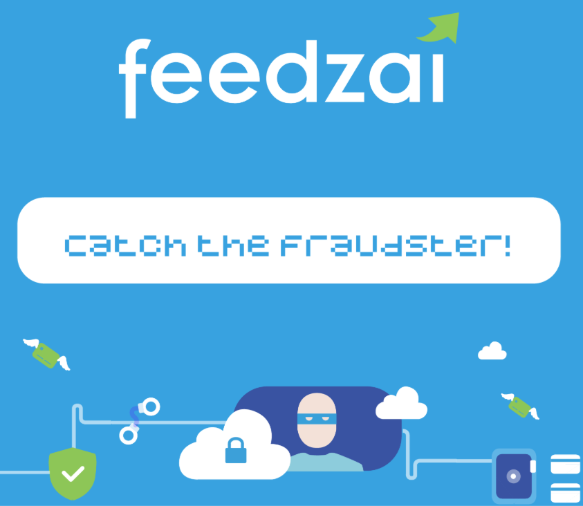
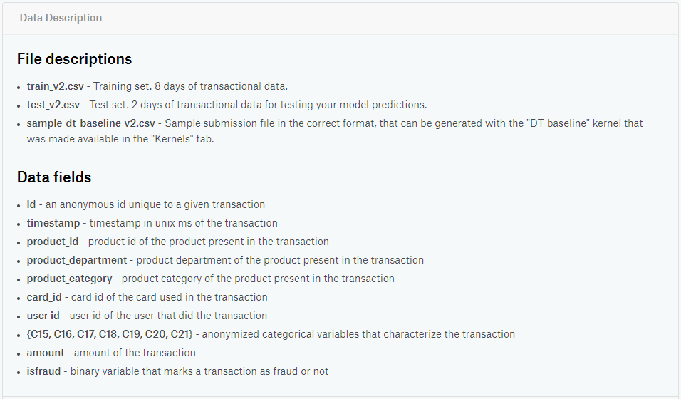

# Feedzai

## Catch the Fraudster!

  

## Context

In Feedzai's challenge “Catch the Fraudster!” we had the chance to take the lead as a Data Scientist fighting fraud! On a daily basis at Feedzai, predictive models process millions of transactions for large banks and online merchants. These models are generated with historical data using the latest Machine Learning/Artificial Intelligence techniques.

I got 2nd place in this competition, which allowed me to do a presentation of my work to Feedzai's Data Science teams from Porto and Lisbon offices.

## Details

In this challenge you will have available a dataset with about 40 million instances, with some characteristics similar to the datasets processed by Feedzai(*). One of the most important such properties is the large asymmetry between the number of fraudulent transactions and the number of legitimate transactions, which makes the data highly unbalanced. This will challenge you to use strategies adapted to catch fraud.

  

(*) For privacy reasons, the data for this competition was obtained by post-processing a publicly available dataset with several characteristics in common with the type of data that Feedzai processes daily.
